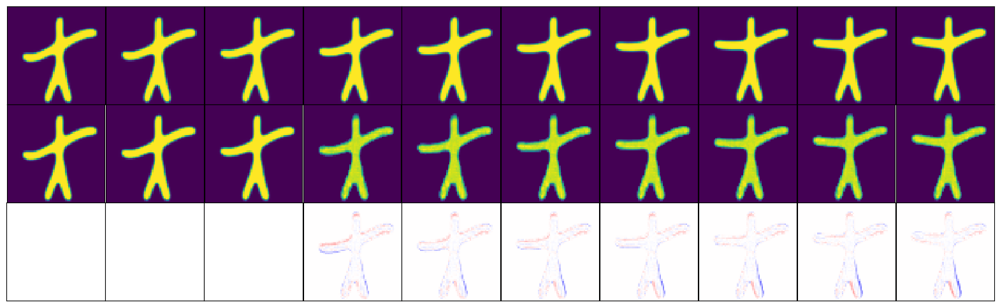

# UOMETM
This package performs the Unsupervised Orthogonal Mixed-Effects Trajectory Modeling (UOMETM) for High-Dimensional Longitudinal Data Analysis.

<div>
 
</div>
<div style="text-align:center">
 
</div>

## Python environment setup with Conda

Under the directory `UOMETM/`
```bash
conda create -n UOMETM python=3.8
conda activate UOMETM
pip install -r requirements.txt
```

## Python implementation for Starmen dataset

Starmen dataset can be downloaded from https://doi.org/10.5281/zenodo.5081988.

The task requires 10000 input images named from `UOMETM/images/SimulatedData__Reconstruction__starman__subject_s0__tp_0.npy` to `UOMETM/images/SimulatedData__Reconstruction__starman__subject_s999__tp_9.npy`, with their detailed information containing in `UOMETM/images/df.csv`.

```bash
python -m Starmen.training.main
```

## Post analysis for Starmen dataset

### Visualization of representation spaces

```bash
python -m Starmen.post_analysis.visualize_ZU_ZV
```

Individual trajectory space $\mathcal{Z}$:
The first row presents the original images from one subject across ten timepoints. The second row presents the constructed individual trajectory.
<div style="text-align:center">
 
</div>

Global trajectory space $\mathcal{Z}^\mathbf{U}$:
The first row presents the constructed global trajectory for this subject. The second row derives from subtraction between adjacent images, where only left arm progression can be observed.
<div style="text-align:center">
 
</div>

Individual heterogeneity space $\mathcal{Z}^\mathbf{V}$:
The first row presents the original images from different subjects. The second row presents the constructed individual heterogeneity. The third row derives from subtraction between adjacent images, where only left arm progression is inconspicuous.
<div style="text-align:center">
 
</div>

### Extrapolation

```bash
python -m Starmen.post_analysis.extrapolation
```

For the $i$-th subject, we utilize the first $k_i=3$ to construct the individual trajectory, via which we extrapolate the latent representations of later timepoints and reconstructe them.

The first row presents the original images from one subject across ten timepoints. The second row contains $k_i=3$ known images and $7$ extrapolated images. The third row derives from subtraction between first two rows, showing excellent extrapolation fidelity.

<div style="text-align:center">
 
</div>

## Post analysis for ADNI dataset

### Visualization of cortical thickness captured in the space $\mathcal{Z}^\mathbf{U}$ on a cortical surface. 
Each column displays results with different diagnostic labels but at the same clinical age, while each row represents the global trajectory of a specific diagnostic group. Remarkably similar results across columns highlight the successful capture of global characteristics.

<div style="text-align:center">
 
</div>
