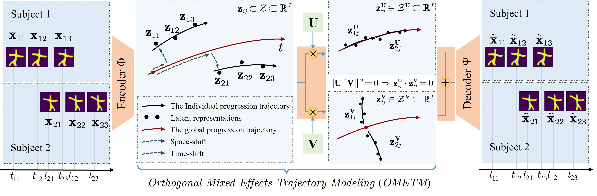
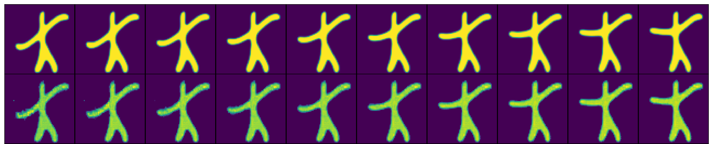
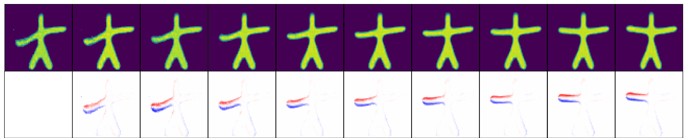

# UOMETM
This package performs the Unsupervised Orthogonal Mixed-Effects Trajectory Modeling (UOMETM) for High-Dimensional Longitudinal Data Analysis.

<div>
 
</div>
<div style="text-align:center">
 
</div>

## Python environment setup with Conda

```bash
conda create -n UOMETM python=3.8
conda activate UOMETM
pip install -r requirements.txt
```

## Model architecture and data preprocessing: `model/`

The model architecture designed for Starmen dataset is present in `model/Starmen/model.py`, which is an antoencoder framework consisting of cascaded convolutional encoder and cascaded transpose convolutional decoder. The architecture for ADNI dataset is displayed in `model/ADNI/model.py`, which is an antoencoder including symmetrical fully-connected encoder and decoder.

`model/Starmen/dataset.py` and `model/ADNI/dataset.py` introduce how to generate training and test sets for each dataset respectively.

## Demo implementation: `demo/`

### Input data (downloaded from https://doi.org/10.5281/zenodo)

The synthetic longitudinal dataset contains 64x64 Starmen images with pixel values normalized in the range of $[0,1]$. The global progression trajectory was the rising stage of the left arm while the individual heterogeneity within this dataset was characterized by the location of other limbs. In total, there are $m=1000$ samples, each with $n_i=10$ observations.  Hence,  this dataset contains a total $N=10000$ observations.

Essential files:
* `demo/images/df.csv`: detailed information for every subject $i$, including age $t_{ij}$ at visit $j$, individual onset $\tau_i$, acceleration factor $\alpha_i$ and paths of numpy array data.

* `demo/images/SimulatedData__Reconstruction__starman__subject_s0__tp_0.npy`: numpy array data for subject 0 timepoint 0, with dimensionality 64x64.
...
* `demo/images/SimulatedData__Reconstruction__starman__subject_s999__tp_9.npy`: numpy array data for subject 999 timepoint 9, with dimensionality 64x64.

### Train UOMETM

Perform with the device "cuda:0" for the first fold of five-fold, with 300 epochs, 1e-3 learning rate and 128 batch size. The dimensionality of the latent space (dimz) is set to 4.
```bash
% Under directory `demo/` run:
python main.py --cuda 0 --fold 0 --epochs 300 --dimz 4 --lr 1e-3 --bs 128
```

## Post analysis on test set with pretrained model: `test/`

### Starmen dataset: `test/Starmen/`

* `0_fold_UOMETM`: pretrained model for the first fold on Starmen dataset
* `visualize_ZUV.py`: visualization code
* `visualization/Z.png`, `visualization/ZU.png`, `visualization/ZV$.png`: visualization results of representation spaces $\mathcal{Z}$, $\mathcal{Z}^\mathbf{U}$ and $\mathcal{Z}^\mathbf{V}$
* `extrapolation.py`: extrapolation code
* `visualization/extrapolation.png`: extrapolation results with missing rate set to 70%

#### Visualization of representation spaces

Individual trajectory space $\mathcal{Z}$:
The first row presents the original images from one subject across ten timepoints. The second row presents the constructed individual trajectory.
<div style="text-align:center">
 
</div>

Global trajectory space $\mathcal{Z}^\mathbf{U}$:
The first row presents the constructed global trajectory for this subject. The second row derives from subtraction between adjacent images, where only left arm progression can be observed.
<div style="text-align:center">
 
</div>

Individual heterogeneity space $\mathcal{Z}^\mathbf{V}$:
The first row presents the original images from different subjects. The second row presents the constructed individual heterogeneity. The third row derives from subtraction between adjacent images, where only left arm progression is inconspicuous.
<div style="text-align:center">
 
</div>

#### Extrapolation

For the $i$-th subject, we utilize the first $k_i=3$ to construct the individual trajectory, via which we extrapolate the latent representations of later timepoints and reconstructe them. The first row presents the original images from one subject across ten timepoints. The second row contains $k_i=3$ known images and $7$ extrapolated images. The third row derives from subtraction between first two rows, showing excellent extrapolation fidelity.

<div style="text-align:center">
 
</div>

### ADNI dataset: `test/ADNI/`

#### Visualization of cortical thickness captured in the $\mathcal{Z}^\mathbf{U}$ on a cortical surface. 

* `drawsurface_avg.m`: cortical surface visualization code
* `visualize_ZU.mat`: cortical thickness data, `year_{age}_{left\right}` (3x163842), that is left or right hemisphere cortical thickness data for three diagnostic groups (each row represents CN, MCI, AD) at the age=60, 68, 77, 85.

Each column displays results with different diagnostic labels but at the same clinical age, while each row represents the global trajectory of a specific diagnostic group. Remarkably similar results across columns highlight the successful capture of global characteristics.

<div style="text-align:center">
 
</div>